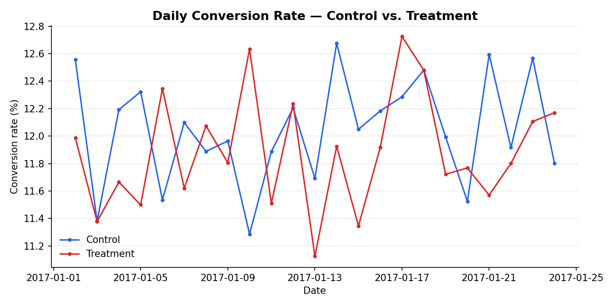
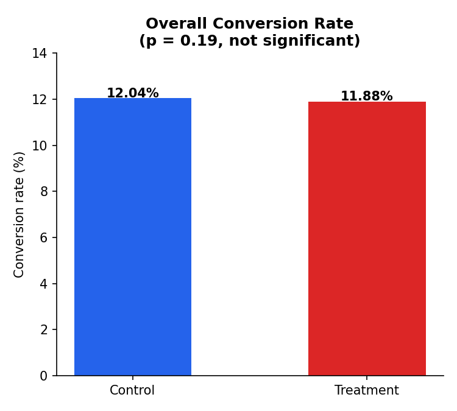

# Website Landing Page A/B Test

A full, reproducible analysis of a website landing-page experiment: data cleaning,
a two-proportion z-test, segmentation checks, and a plain-English shipping
recommendation — in Python, SQL, and Excel.



## Business question

Should the e-commerce team replace the old landing page with the new one?

## TL;DR result

| Measure | Result |
|---|---:|
| Control conversion | 12.039% |
| Treatment conversion | 11.881% |
| Treatment − control | −0.158 pp |
| Relative change | −1.31% |
| p-value | 0.190 |
| 95% CI | −0.394 to +0.078 pp |

**Decision: do not ship the new page based on this experiment alone.** The
point estimate is slightly negative, but the p-value is well above 0.05 and
the confidence interval spans both a modest loss and a modest gain — this
test cannot distinguish the new page from having no effect at all.



See [Statistical result](#statistical-result) and [Decision](#decision) below
for the full reasoning, or open [`notebook.ipynb`](notebook.ipynb) for the
worked analysis with commentary.

## Data provenance

The unmodified source files in `data/` were supplied with this project.

| File | Origin | Contents |
|---|---|---|
| `ab_data.csv` | Udacity course A/B-test dataset | 294,478 rows: user, timestamp, experimental group, page, conversion |
| `countries.csv` | Udacity course A/B-test dataset | 290,584 user-to-country mappings for UK, US, and CA |

This is a real historical educational dataset, not data invented for this
project. It's kept locally so the analysis is reproducible without depending
on a source that could change or disappear. **Conclusions apply to this
experiment, not to current e-commerce traffic.**

## Cleaning before testing

Two things can invalidate a raw row, so both are checked before any test runs:

1. **Invalid assignment/page pairing** — `control` should only ever see
   `old_page`, `treatment` only `new_page`. A row that breaks this can't be
   trusted, so it's dropped rather than guessed at. **3,893 rows removed.**
2. **Repeat exposures** — some `user_id`s appear more than once. Only the
   first valid exposure per user is kept, so the z-test's independence
   assumption holds (one row = one independent observation). **1 more row
   removed** after step 1.

The final clean population has **290,584 rows**, zero duplicate user IDs, and
only `control`/`old_page` and `treatment`/`new_page` combinations. The full
audit trail is in [`outputs/data_quality_audit.csv`](outputs/data_quality_audit.csv),
and the same checks are written as standalone queries in
[`sql/sql_queries.sql`](sql/sql_queries.sql) so they don't have to be trusted
from Python alone.

## Statistical result

- **Metric:** conversion rate (binary outcome per user)
- **H0:** control and treatment conversion rates are equal
- **H1:** they differ
- **Test:** two-proportion z-test (appropriate for comparing two binary rates)
- statsmodels' `proportions_ztest` is used when available; a mathematically
  equivalent pooled-z fallback is built in for environments without it.

| Measure | Result |
|---|---:|
| Control conversion | 12.039% |
| Treatment conversion | 11.881% |
| Treatment minus control | −0.158 percentage points |
| Relative change | −1.31% |
| p-value | 0.190 |
| 95% confidence interval | −0.394 to +0.078 percentage points |

## Decision

Do not ship the new page based on this experiment alone. The observed result
is negative and the p-value exceeds 0.05 — that doesn't prove the pages are
equal, it means the test didn't provide sufficient evidence of a difference.
At an illustrative 100,000 monthly visits, the observed effect is about 158
fewer conversions, but the confidence interval spans a modest loss and gain.

The test ran for **22 days**. Country and daily outputs (below) support
balance, segment, and stability checks. A future test should be pre-powered
around a defined minimum worthwhile lift, since this one's interval is too
wide to rule out a meaningful gain or loss.

## Segmentation & stability checks (exploratory)

These are sanity checks, not standalone shipping decisions — they weren't
pre-registered, and comparing three countries without a multiple-comparison
correction inflates the false-positive rate.

- **Country breakdown** ([`outputs/country_results.csv`](outputs/country_results.csv)):
  UK, US, and CA all show p > 0.05 individually and no country stands out as
  wildly unbalanced.
- **Daily conversion rate** ([`outputs/daily_conversion.csv`](outputs/daily_conversion.csv),
  charted above): both groups track each other closely for the full 22 days —
  no single-day anomaly is driving the headline result.

## Project structure

```
.
├── analyze.py                      # end-to-end script: clean → test → segment → recommend
├── notebook.ipynb                  # same analysis, cell-by-cell, with commentary — start here
├── Website_AB_Test_Analysis.xlsx   # editable Excel companion (live formulas, chart)
├── requirements.txt
├── data/
│   ├── ab_data.csv                 # raw experiment data (supplied, untouched)
│   └── countries.csv               # raw user→country mapping (supplied, untouched)
├── sql/
│   └── sql_queries.sql             # standalone SQL validation of the same cleaning/test logic
├── outputs/                        # everything analyze.py generates
│   ├── ab_clean.csv                # one row per user, valid pairings only
│   ├── ab_test.sqlite              # ab_raw / ab_clean / countries tables
│   ├── ab_test_summary.csv         # headline z-test result
│   ├── country_results.csv         # per-country breakdown
│   ├── daily_conversion.csv        # per-day conversion rate
│   ├── data_quality_audit.csv      # row counts through each cleaning step
│   └── business_recommendation.csv # plain-English recommendation + traffic estimate
├── docs/
│   ├── data_dictionary.md          # field definitions
│   ├── dashboard_spec.md           # spec for a downstream dashboard build
│   └── images/                     # charts used in this README
└── README.md
```

## How to run

```bash
pip install -r requirements.txt
python analyze.py
```

This regenerates everything in `outputs/` from the raw files in `data/`.
`ab_clean.csv` and `ab_test.sqlite` are derived artifacts (regenerated by the
script), so they're excluded from version control — see `.gitignore`.

Or open `notebook.ipynb` and run all cells for the same analysis with
explanatory markdown between each step.

## Files

- Supplied original CSVs in `data/`
- `analyze.py` for cleaning and testing
- `notebook.ipynb`, the same analysis with commentary
- SQL validation queries in `sql/`
- Clean data, SQLite, audit, test, country, and daily outputs in `outputs/`
- Editable Excel analysis workbook with live formulas
- Documentation (data dictionary, dashboard spec) in `docs/`

## Limitations

The dataset lacks margin, revenue per conversion, device, traffic-source, and
pre-registered sample-size information. Country cuts are exploratory, so
adjust for multiple comparisons before using one country result as a shipping
decision on its own.
